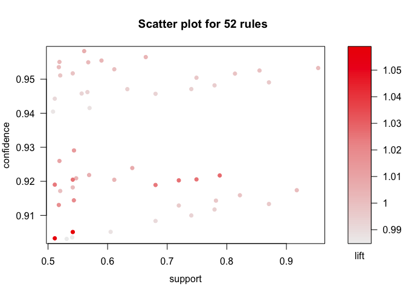
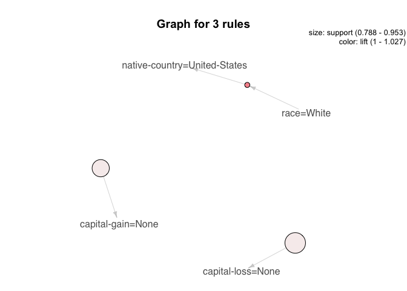

Association Rule Learning: Adult
================

#### Load packages

``` r
library(tidyverse)  # data manipulation
library(arules)    # clustering algorithms
```

#### `arules::Adult` dataset

``` r
data("Adult")
summary(Adult)
```

    ## transactions as itemMatrix in sparse format with
    ##  48842 rows (elements/itemsets/transactions) and
    ##  115 columns (items) and a density of 0.1089939 
    ## 
    ## most frequent items:
    ##            capital-loss=None            capital-gain=None 
    ##                        46560                        44807 
    ## native-country=United-States                   race=White 
    ##                        43832                        41762 
    ##            workclass=Private                      (Other) 
    ##                        33906                       401333 
    ## 
    ## element (itemset/transaction) length distribution:
    ## sizes
    ##     9    10    11    12    13 
    ##    19   971  2067 15623 30162 
    ## 
    ##    Min. 1st Qu.  Median    Mean 3rd Qu.    Max. 
    ##    9.00   12.00   13.00   12.53   13.00   13.00 
    ## 
    ## includes extended item information - examples:
    ##            labels variables      levels
    ## 1       age=Young       age       Young
    ## 2 age=Middle-aged       age Middle-aged
    ## 3      age=Senior       age      Senior
    ## 
    ## includes extended transaction information - examples:
    ##   transactionID
    ## 1             1
    ## 2             2
    ## 3             3

``` r
rules <- apriori(Adult, parameter = list(supp = 0.5, conf = 0.9, target = "rules"))
```

    ## Apriori
    ## 
    ## Parameter specification:
    ##  confidence minval smax arem  aval originalSupport maxtime support minlen
    ##         0.9    0.1    1 none FALSE            TRUE       5     0.5      1
    ##  maxlen target   ext
    ##      10  rules FALSE
    ## 
    ## Algorithmic control:
    ##  filter tree heap memopt load sort verbose
    ##     0.1 TRUE TRUE  FALSE TRUE    2    TRUE
    ## 
    ## Absolute minimum support count: 24421 
    ## 
    ## set item appearances ...[0 item(s)] done [0.00s].
    ## set transactions ...[115 item(s), 48842 transaction(s)] done [0.04s].
    ## sorting and recoding items ... [9 item(s)] done [0.00s].
    ## creating transaction tree ... done [0.02s].
    ## checking subsets of size 1 2 3 4 done [0.00s].
    ## writing ... [52 rule(s)] done [0.00s].
    ## creating S4 object  ... done [0.01s].

``` r
inspect(head(rules, by = "lift"))
```

    ##     lhs                               rhs                              support confidence     lift count
    ## [1] {sex=Male,                                                                                          
    ##      native-country=United-States} => {race=White}                   0.5415421  0.9051090 1.058554 26450
    ## [2] {sex=Male,                                                                                          
    ##      capital-loss=None,                                                                                 
    ##      native-country=United-States} => {race=White}                   0.5113632  0.9032585 1.056390 24976
    ## [3] {race=White}                   => {native-country=United-States} 0.7881127  0.9217231 1.027076 38493
    ## [4] {race=White,                                                                                        
    ##      capital-loss=None}            => {native-country=United-States} 0.7490480  0.9205626 1.025783 36585
    ## [5] {race=White,                                                                                        
    ##      sex=Male}                     => {native-country=United-States} 0.5415421  0.9204803 1.025691 26450
    ## [6] {race=White,                                                                                        
    ##      capital-gain=None}            => {native-country=United-States} 0.7194628  0.9202807 1.025469 35140

#### Remove Redundant Rules

``` r
subsetRules <- which(colSums(is.subset(rules, rules)) > 1) # get subset rules in vector
length(subsetRules)  
```

    ## [1] 49

``` r
rules_red <- rules[-subsetRules]
inspect(head(rules_red, by = "lift"))
```

    ##     lhs             rhs                            support   confidence
    ## [1] {race=White} => {native-country=United-States} 0.7881127 0.9217231 
    ## [2] {}           => {capital-gain=None}            0.9173867 0.9173867 
    ## [3] {}           => {capital-loss=None}            0.9532779 0.9532779 
    ##     lift     count
    ## [1] 1.027076 38493
    ## [2] 1.000000 44807
    ## [3] 1.000000 46560

#### Visualize Association Rules

``` r
library(arulesViz)
```

    ## Loading required package: grid

``` r
plot(rules)
```

<!-- -->

``` r
plot(rules_red, method = "graph", control = list(type = "items"))
```

    ## Warning: Unknown control parameters: type

    ## Available control parameters (with default values):
    ## main  =  Graph for 3 rules
    ## nodeColors    =  c("#66CC6680", "#9999CC80")
    ## nodeCol   =  c("#EE0000FF", "#EE0303FF", "#EE0606FF", "#EE0909FF", "#EE0C0CFF", "#EE0F0FFF", "#EE1212FF", "#EE1515FF", "#EE1818FF", "#EE1B1BFF", "#EE1E1EFF", "#EE2222FF", "#EE2525FF", "#EE2828FF", "#EE2B2BFF", "#EE2E2EFF", "#EE3131FF", "#EE3434FF", "#EE3737FF", "#EE3A3AFF", "#EE3D3DFF", "#EE4040FF", "#EE4444FF", "#EE4747FF", "#EE4A4AFF", "#EE4D4DFF", "#EE5050FF", "#EE5353FF", "#EE5656FF", "#EE5959FF", "#EE5C5CFF", "#EE5F5FFF", "#EE6262FF", "#EE6666FF", "#EE6969FF", "#EE6C6CFF", "#EE6F6FFF", "#EE7272FF", "#EE7575FF",  "#EE7878FF", "#EE7B7BFF", "#EE7E7EFF", "#EE8181FF", "#EE8484FF", "#EE8888FF", "#EE8B8BFF", "#EE8E8EFF", "#EE9191FF", "#EE9494FF", "#EE9797FF", "#EE9999FF", "#EE9B9BFF", "#EE9D9DFF", "#EE9F9FFF", "#EEA0A0FF", "#EEA2A2FF", "#EEA4A4FF", "#EEA5A5FF", "#EEA7A7FF", "#EEA9A9FF", "#EEABABFF", "#EEACACFF", "#EEAEAEFF", "#EEB0B0FF", "#EEB1B1FF", "#EEB3B3FF", "#EEB5B5FF", "#EEB7B7FF", "#EEB8B8FF", "#EEBABAFF", "#EEBCBCFF", "#EEBDBDFF", "#EEBFBFFF", "#EEC1C1FF", "#EEC3C3FF", "#EEC4C4FF", "#EEC6C6FF", "#EEC8C8FF",  "#EEC9C9FF", "#EECBCBFF", "#EECDCDFF", "#EECFCFFF", "#EED0D0FF", "#EED2D2FF", "#EED4D4FF", "#EED5D5FF", "#EED7D7FF", "#EED9D9FF", "#EEDBDBFF", "#EEDCDCFF", "#EEDEDEFF", "#EEE0E0FF", "#EEE1E1FF", "#EEE3E3FF", "#EEE5E5FF", "#EEE7E7FF", "#EEE8E8FF", "#EEEAEAFF", "#EEECECFF", "#EEEEEEFF")
    ## edgeCol   =  c("#474747FF", "#494949FF", "#4B4B4BFF", "#4D4D4DFF", "#4F4F4FFF", "#515151FF", "#535353FF", "#555555FF", "#575757FF", "#595959FF", "#5B5B5BFF", "#5E5E5EFF", "#606060FF", "#626262FF", "#646464FF", "#666666FF", "#686868FF", "#6A6A6AFF", "#6C6C6CFF", "#6E6E6EFF", "#707070FF", "#727272FF", "#747474FF", "#767676FF", "#787878FF", "#7A7A7AFF", "#7C7C7CFF", "#7E7E7EFF", "#808080FF", "#828282FF", "#848484FF", "#868686FF", "#888888FF", "#8A8A8AFF", "#8C8C8CFF", "#8D8D8DFF", "#8F8F8FFF", "#919191FF", "#939393FF",  "#959595FF", "#979797FF", "#999999FF", "#9A9A9AFF", "#9C9C9CFF", "#9E9E9EFF", "#A0A0A0FF", "#A2A2A2FF", "#A3A3A3FF", "#A5A5A5FF", "#A7A7A7FF", "#A9A9A9FF", "#AAAAAAFF", "#ACACACFF", "#AEAEAEFF", "#AFAFAFFF", "#B1B1B1FF", "#B3B3B3FF", "#B4B4B4FF", "#B6B6B6FF", "#B7B7B7FF", "#B9B9B9FF", "#BBBBBBFF", "#BCBCBCFF", "#BEBEBEFF", "#BFBFBFFF", "#C1C1C1FF", "#C2C2C2FF", "#C3C3C4FF", "#C5C5C5FF", "#C6C6C6FF", "#C8C8C8FF", "#C9C9C9FF", "#CACACAFF", "#CCCCCCFF", "#CDCDCDFF", "#CECECEFF", "#CFCFCFFF", "#D1D1D1FF",  "#D2D2D2FF", "#D3D3D3FF", "#D4D4D4FF", "#D5D5D5FF", "#D6D6D6FF", "#D7D7D7FF", "#D8D8D8FF", "#D9D9D9FF", "#DADADAFF", "#DBDBDBFF", "#DCDCDCFF", "#DDDDDDFF", "#DEDEDEFF", "#DEDEDEFF", "#DFDFDFFF", "#E0E0E0FF", "#E0E0E0FF", "#E1E1E1FF", "#E1E1E1FF", "#E2E2E2FF", "#E2E2E2FF", "#E2E2E2FF")
    ## alpha     =  0.5
    ## cex   =  1
    ## itemLabels    =  TRUE
    ## labelCol  =  #000000B3
    ## measureLabels     =  FALSE
    ## precision     =  3
    ## layout    =  NULL
    ## layoutParams  =  list()
    ## arrowSize     =  0.5
    ## engine    =  igraph
    ## plot  =  TRUE
    ## plot_options  =  list()
    ## max   =  100
    ## verbose   =  FALSE

<!-- -->
