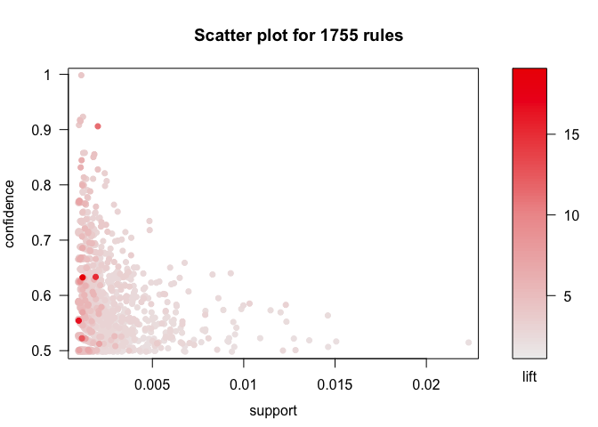
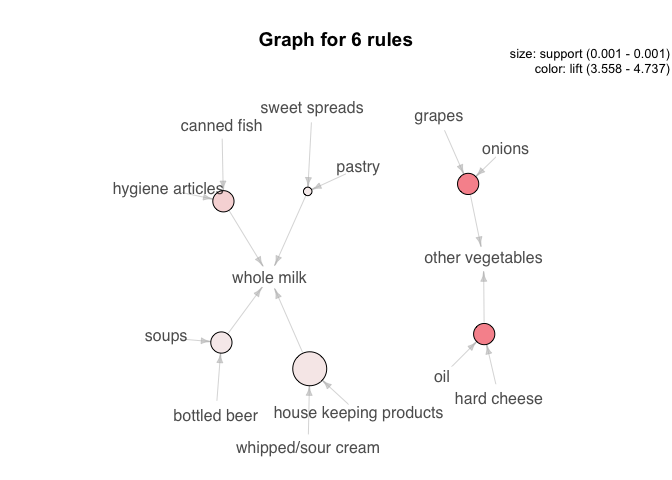

Association Rule Learning: Groceries
================

#### Load packages

``` r
library(tidyverse)  # data manipulation
library(arules)    # clustering algorithms
```

##### transaction class

``` r
data(Groceries)
class(Groceries)
```

    ## [1] "transactions"
    ## attr(,"package")
    ## [1] "arules"

``` r
inspect(head(Groceries))
```

    ##     items                     
    ## [1] {citrus fruit,            
    ##      semi-finished bread,     
    ##      margarine,               
    ##      ready soups}             
    ## [2] {tropical fruit,          
    ##      yogurt,                  
    ##      coffee}                  
    ## [3] {whole milk}              
    ## [4] {pip fruit,               
    ##      yogurt,                  
    ##      cream cheese ,           
    ##      meat spreads}            
    ## [5] {other vegetables,        
    ##      whole milk,              
    ##      condensed milk,          
    ##      long life bakery product}
    ## [6] {whole milk,              
    ##      butter,                  
    ##      yogurt,                  
    ##      rice,                    
    ##      abrasive cleaner}

#### Most frequent items

``` r
frequentItems <- eclat (Groceries, parameter = list(supp = 0.07, maxlen = 15)) 
```

    ## Eclat
    ## 
    ## parameter specification:
    ##  tidLists support minlen maxlen            target   ext
    ##     FALSE    0.07      1     15 frequent itemsets FALSE
    ## 
    ## algorithmic control:
    ##  sparse sort verbose
    ##       7   -2    TRUE
    ## 
    ## Absolute minimum support count: 688 
    ## 
    ## create itemset ... 
    ## set transactions ...[169 item(s), 9835 transaction(s)] done [0.00s].
    ## sorting and recoding items ... [18 item(s)] done [0.00s].
    ## creating sparse bit matrix ... [18 row(s), 9835 column(s)] done [0.00s].
    ## writing  ... [19 set(s)] done [0.00s].
    ## Creating S4 object  ... done [0.00s].

``` r
inspect(frequentItems)
```

    ##      items                         support    count
    ## [1]  {other vegetables,whole milk} 0.07483477  736 
    ## [2]  {whole milk}                  0.25551601 2513 
    ## [3]  {other vegetables}            0.19349263 1903 
    ## [4]  {rolls/buns}                  0.18393493 1809 
    ## [5]  {yogurt}                      0.13950178 1372 
    ## [6]  {soda}                        0.17437722 1715 
    ## [7]  {root vegetables}             0.10899847 1072 
    ## [8]  {tropical fruit}              0.10493137 1032 
    ## [9]  {bottled water}               0.11052364 1087 
    ## [10] {sausage}                     0.09395018  924 
    ## [11] {shopping bags}               0.09852567  969 
    ## [12] {citrus fruit}                0.08276563  814 
    ## [13] {pastry}                      0.08896797  875 
    ## [14] {pip fruit}                   0.07564820  744 
    ## [15] {whipped/sour cream}          0.07168277  705 
    ## [16] {fruit/vegetable juice}       0.07229283  711 
    ## [17] {newspapers}                  0.07981698  785 
    ## [18] {bottled beer}                0.08052872  792 
    ## [19] {canned beer}                 0.07768175  764

``` r
# plot frequent items
itemFrequencyPlot(Groceries, topN=10, type="absolute", main="Item Frequency") 
```

<!-- -->

#### Product recommendation rules

``` r
# Min Support as 0.001, confidence as 0.8.
rules <- apriori (Groceries, parameter = list(supp = 0.001, conf = 0.5)) 
```

    ## Apriori
    ## 
    ## Parameter specification:
    ##  confidence minval smax arem  aval originalSupport maxtime support minlen
    ##         0.5    0.1    1 none FALSE            TRUE       5   0.001      1
    ##  maxlen target   ext
    ##      10  rules FALSE
    ## 
    ## Algorithmic control:
    ##  filter tree heap memopt load sort verbose
    ##     0.1 TRUE TRUE  FALSE TRUE    2    TRUE
    ## 
    ## Absolute minimum support count: 9 
    ## 
    ## set item appearances ...[0 item(s)] done [0.00s].
    ## set transactions ...[169 item(s), 9835 transaction(s)] done [0.01s].
    ## sorting and recoding items ... [157 item(s)] done [0.00s].
    ## creating transaction tree ... done [0.01s].
    ## checking subsets of size 1 2 3 4 5 6 done [0.02s].
    ## writing ... [5668 rule(s)] done [0.00s].
    ## creating S4 object  ... done [0.00s].

``` r
rules_conf <- sort (rules, by = "confidence", decreasing = TRUE) # 'high-confidence' rules.
inspect(head(rules_conf))
```

    ##     lhs                     rhs                    support confidence     lift count
    ## [1] {rice,                                                                          
    ##      sugar}              => {whole milk}       0.001220132          1 3.913649    12
    ## [2] {canned fish,                                                                   
    ##      hygiene articles}   => {whole milk}       0.001118454          1 3.913649    11
    ## [3] {root vegetables,                                                               
    ##      butter,                                                                        
    ##      rice}               => {whole milk}       0.001016777          1 3.913649    10
    ## [4] {root vegetables,                                                               
    ##      whipped/sour cream,                                                            
    ##      flour}              => {whole milk}       0.001728521          1 3.913649    17
    ## [5] {butter,                                                                        
    ##      soft cheese,                                                                   
    ##      domestic eggs}      => {whole milk}       0.001016777          1 3.913649    10
    ## [6] {citrus fruit,                                                                  
    ##      root vegetables,                                                               
    ##      soft cheese}        => {other vegetables} 0.001016777          1 5.168156    10

``` r
rules_lift <- sort (rules, by = "lift", decreasing = TRUE) # 'high-lift' rules.
inspect(head(rules_lift))
```

    ##     lhs                        rhs                  support confidence     lift count
    ## [1] {Instant food products,                                                          
    ##      soda}                  => {hamburger meat} 0.001220132  0.6315789 18.99565    12
    ## [2] {soda,                                                                           
    ##      popcorn}               => {salty snack}    0.001220132  0.6315789 16.69779    12
    ## [3] {flour,                                                                          
    ##      baking powder}         => {sugar}          0.001016777  0.5555556 16.40807    10
    ## [4] {ham,                                                                            
    ##      processed cheese}      => {white bread}    0.001931876  0.6333333 15.04549    19
    ## [5] {whole milk,                                                                     
    ##      Instant food products} => {hamburger meat} 0.001525165  0.5000000 15.03823    15
    ## [6] {other vegetables,                                                               
    ##      curd,                                                                           
    ##      yogurt,                                                                         
    ##      whipped/sour cream}    => {cream cheese }  0.001016777  0.5882353 14.83409    10

#### Remove Redundant Rules

``` r
subsetRules <- which(colSums(is.subset(rules, rules)) > 1) # get subset rules in vector
length(subsetRules)  
```

    ## [1] 3913

``` r
rules <- rules[-subsetRules]
```

#### Visualize Association Rules

``` r
library(arulesViz)
```

    ## Loading required package: grid

``` r
plot(rules)
```

    ## To reduce overplotting, jitter is added! Use jitter = 0 to prevent jitter.

<!-- -->

``` r
rules %>% 
  sort (by = "confidence", decreasing = TRUE) %>% 
  head(m= 50) %>% 
  plot(method = "graph")
```

<!-- -->

#### Rules Related To Given Item/s

##### right hand side (rhs)

``` r
rules <- apriori (data=Groceries, 
                  parameter= list (supp = 0.001, conf = 0.08), 
                  appearance = list (default = "lhs", rhs = "whole milk"), 
                  control = list (verbose= F)) # get rules that lead to buying 'whole milk'

rules_conf <- sort (rules, by = "confidence", decreasing = TRUE) # 'high-confidence' rules.
inspect(head(rules_conf))
```

    ##     lhs                     rhs              support confidence     lift count
    ## [1] {rice,                                                                    
    ##      sugar}              => {whole milk} 0.001220132          1 3.913649    12
    ## [2] {canned fish,                                                             
    ##      hygiene articles}   => {whole milk} 0.001118454          1 3.913649    11
    ## [3] {root vegetables,                                                         
    ##      butter,                                                                  
    ##      rice}               => {whole milk} 0.001016777          1 3.913649    10
    ## [4] {root vegetables,                                                         
    ##      whipped/sour cream,                                                      
    ##      flour}              => {whole milk} 0.001728521          1 3.913649    17
    ## [5] {butter,                                                                  
    ##      soft cheese,                                                             
    ##      domestic eggs}      => {whole milk} 0.001016777          1 3.913649    10
    ## [6] {pip fruit,                                                               
    ##      butter,                                                                  
    ##      hygiene articles}   => {whole milk} 0.001016777          1 3.913649    10

##### left hand side (lhs)

``` r
rules <- apriori (data=Groceries, 
                  parameter=list (supp = 0.001, conf = 0.15,minlen=2), 
                  appearance = list(default = "rhs",lhs = "whole milk"), 
                  control = list (verbose = F)) # those who bought 'milk' also bought..
rules_conf <- sort (rules, by = "confidence", decreasing = TRUE) # 'high-confidence' rules.
inspect(head(rules_conf))
```

    ##     lhs             rhs                support    confidence lift     
    ## [1] {whole milk} => {other vegetables} 0.07483477 0.2928770  1.5136341
    ## [2] {whole milk} => {rolls/buns}       0.05663447 0.2216474  1.2050318
    ## [3] {whole milk} => {yogurt}           0.05602440 0.2192598  1.5717351
    ## [4] {whole milk} => {root vegetables}  0.04890696 0.1914047  1.7560310
    ## [5] {whole milk} => {tropical fruit}   0.04229792 0.1655392  1.5775950
    ## [6] {whole milk} => {soda}             0.04006101 0.1567847  0.8991124
    ##     count
    ## [1] 736  
    ## [2] 557  
    ## [3] 551  
    ## [4] 481  
    ## [5] 416  
    ## [6] 394
