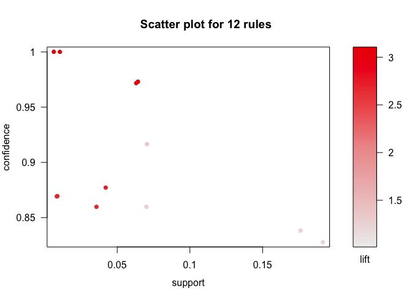
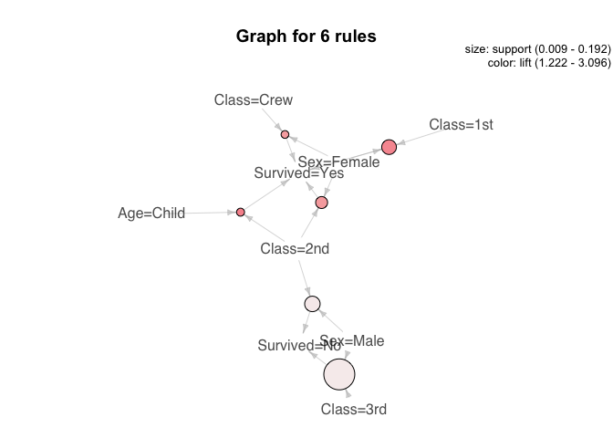

Association Rule Learning: Adult
================

Case study from
[RDataMining](http://www.rdatamining.com/examples/association-rules)  
\#\#\#\# Load packages

``` r
library(tidyverse)  # data manipulation
library(arules)    # clustering algorithms
```

#### `titanic.raw.rdata` dataset

``` r
titanic.raw <- get(load("titanic.raw.rdata"))
str(titanic.raw)
```

    ## 'data.frame':    2201 obs. of  4 variables:
    ##  $ Class   : Factor w/ 4 levels "1st","2nd","3rd",..: 3 3 3 3 3 3 3 3 3 3 ...
    ##  $ Sex     : Factor w/ 2 levels "Female","Male": 2 2 2 2 2 2 2 2 2 2 ...
    ##  $ Age     : Factor w/ 2 levels "Adult","Child": 2 2 2 2 2 2 2 2 2 2 ...
    ##  $ Survived: Factor w/ 2 levels "No","Yes": 1 1 1 1 1 1 1 1 1 1 ...

``` r
rules <- apriori(titanic.raw)
```

    ## Apriori
    ## 
    ## Parameter specification:
    ##  confidence minval smax arem  aval originalSupport maxtime support minlen
    ##         0.8    0.1    1 none FALSE            TRUE       5     0.1      1
    ##  maxlen target   ext
    ##      10  rules FALSE
    ## 
    ## Algorithmic control:
    ##  filter tree heap memopt load sort verbose
    ##     0.1 TRUE TRUE  FALSE TRUE    2    TRUE
    ## 
    ## Absolute minimum support count: 220 
    ## 
    ## set item appearances ...[0 item(s)] done [0.00s].
    ## set transactions ...[10 item(s), 2201 transaction(s)] done [0.00s].
    ## sorting and recoding items ... [9 item(s)] done [0.00s].
    ## creating transaction tree ... done [0.00s].
    ## checking subsets of size 1 2 3 4 done [0.00s].
    ## writing ... [27 rule(s)] done [0.00s].
    ## creating S4 object  ... done [0.00s].

``` r
inspect(head(rules, by = "confidence"))
```

    ##     lhs                                   rhs         support   confidence
    ## [1] {Class=Crew}                       => {Age=Adult} 0.4020900 1.0000000 
    ## [2] {Class=Crew,Survived=No}           => {Age=Adult} 0.3057701 1.0000000 
    ## [3] {Class=Crew,Sex=Male}              => {Age=Adult} 0.3916402 1.0000000 
    ## [4] {Class=Crew,Sex=Male,Survived=No}  => {Age=Adult} 0.3044071 1.0000000 
    ## [5] {Class=Crew,Survived=No}           => {Sex=Male}  0.3044071 0.9955423 
    ## [6] {Class=Crew,Age=Adult,Survived=No} => {Sex=Male}  0.3044071 0.9955423 
    ##     lift     count
    ## [1] 1.052103 885  
    ## [2] 1.052103 673  
    ## [3] 1.052103 862  
    ## [4] 1.052103 670  
    ## [5] 1.265851 670  
    ## [6] 1.265851 670

#### “Survived” only

``` r
# rules with rhs containing "Survived" only
rules <- apriori(titanic.raw,
                 parameter = list(minlen = 2, supp = 0.005, conf = 0.8),
                 appearance = list(rhs = c("Survived=No", "Survived=Yes"),
                                   default = "lhs"),
                 control = list(verbose = F))
rules.sorted <- sort(rules, by = "lift")
inspect(rules.sorted)
```

    ##      lhs                                  rhs            support    
    ## [1]  {Class=2nd,Age=Child}             => {Survived=Yes} 0.010904134
    ## [2]  {Class=2nd,Sex=Female,Age=Child}  => {Survived=Yes} 0.005906406
    ## [3]  {Class=1st,Sex=Female}            => {Survived=Yes} 0.064061790
    ## [4]  {Class=1st,Sex=Female,Age=Adult}  => {Survived=Yes} 0.063607451
    ## [5]  {Class=2nd,Sex=Female}            => {Survived=Yes} 0.042253521
    ## [6]  {Class=Crew,Sex=Female}           => {Survived=Yes} 0.009086779
    ## [7]  {Class=Crew,Sex=Female,Age=Adult} => {Survived=Yes} 0.009086779
    ## [8]  {Class=2nd,Sex=Female,Age=Adult}  => {Survived=Yes} 0.036347115
    ## [9]  {Class=2nd,Sex=Male,Age=Adult}    => {Survived=No}  0.069968196
    ## [10] {Class=2nd,Sex=Male}              => {Survived=No}  0.069968196
    ## [11] {Class=3rd,Sex=Male,Age=Adult}    => {Survived=No}  0.175829169
    ## [12] {Class=3rd,Sex=Male}              => {Survived=No}  0.191731031
    ##      confidence lift     count
    ## [1]  1.0000000  3.095640  24  
    ## [2]  1.0000000  3.095640  13  
    ## [3]  0.9724138  3.010243 141  
    ## [4]  0.9722222  3.009650 140  
    ## [5]  0.8773585  2.715986  93  
    ## [6]  0.8695652  2.691861  20  
    ## [7]  0.8695652  2.691861  20  
    ## [8]  0.8602151  2.662916  80  
    ## [9]  0.9166667  1.354083 154  
    ## [10] 0.8603352  1.270871 154  
    ## [11] 0.8376623  1.237379 387  
    ## [12] 0.8274510  1.222295 422

#### Remove Redundant Rules

``` r
subsetRules <- which(colSums(is.subset(rules.sorted, rules.sorted)) > 1) # get subset rules in vector
length(subsetRules)  
```

    ## [1] 6

``` r
rules_red <- rules.sorted[-subsetRules]
inspect(rules_red)
```

    ##     lhs                        rhs            support     confidence
    ## [1] {Class=2nd,Age=Child}   => {Survived=Yes} 0.010904134 1.0000000 
    ## [2] {Class=1st,Sex=Female}  => {Survived=Yes} 0.064061790 0.9724138 
    ## [3] {Class=2nd,Sex=Female}  => {Survived=Yes} 0.042253521 0.8773585 
    ## [4] {Class=Crew,Sex=Female} => {Survived=Yes} 0.009086779 0.8695652 
    ## [5] {Class=2nd,Sex=Male}    => {Survived=No}  0.069968196 0.8603352 
    ## [6] {Class=3rd,Sex=Male}    => {Survived=No}  0.191731031 0.8274510 
    ##     lift     count
    ## [1] 3.095640  24  
    ## [2] 3.010243 141  
    ## [3] 2.715986  93  
    ## [4] 2.691861  20  
    ## [5] 1.270871 154  
    ## [6] 1.222295 422

``` r
subset.matrix <- is.subset(rules.sorted, rules.sorted)
subset.matrix[lower.tri(subset.matrix, diag = T)] <- NA
```

    ## Warning in `[<-`(`*tmp*`, as.vector(i), value = NA): x[.] <- val: x is
    ## "ngTMatrix", val not in {TRUE, FALSE} is coerced; NA |--> TRUE.

``` r
redundant <- colSums(subset.matrix, na.rm = T) >= 1
which(redundant)
```

    ##             {Class=2nd,Age=Child,Survived=Yes} 
    ##                                              1 
    ##  {Class=2nd,Sex=Female,Age=Child,Survived=Yes} 
    ##                                              2 
    ##            {Class=1st,Sex=Female,Survived=Yes} 
    ##                                              3 
    ##  {Class=1st,Sex=Female,Age=Adult,Survived=Yes} 
    ##                                              4 
    ##            {Class=2nd,Sex=Female,Survived=Yes} 
    ##                                              5 
    ##           {Class=Crew,Sex=Female,Survived=Yes} 
    ##                                              6 
    ## {Class=Crew,Sex=Female,Age=Adult,Survived=Yes} 
    ##                                              7 
    ##  {Class=2nd,Sex=Female,Age=Adult,Survived=Yes} 
    ##                                              8 
    ##     {Class=2nd,Sex=Male,Age=Adult,Survived=No} 
    ##                                              9 
    ##               {Class=2nd,Sex=Male,Survived=No} 
    ##                                             10 
    ##     {Class=3rd,Sex=Male,Age=Adult,Survived=No} 
    ##                                             11 
    ##               {Class=3rd,Sex=Male,Survived=No} 
    ##                                             12

``` r
rules.pruned <- rules.sorted[-redundant]
inspect(rules.pruned)
```

    ##      lhs                                  rhs            support    
    ## [1]  {Class=2nd,Sex=Female,Age=Child}  => {Survived=Yes} 0.005906406
    ## [2]  {Class=1st,Sex=Female}            => {Survived=Yes} 0.064061790
    ## [3]  {Class=1st,Sex=Female,Age=Adult}  => {Survived=Yes} 0.063607451
    ## [4]  {Class=2nd,Sex=Female}            => {Survived=Yes} 0.042253521
    ## [5]  {Class=Crew,Sex=Female}           => {Survived=Yes} 0.009086779
    ## [6]  {Class=Crew,Sex=Female,Age=Adult} => {Survived=Yes} 0.009086779
    ## [7]  {Class=2nd,Sex=Female,Age=Adult}  => {Survived=Yes} 0.036347115
    ## [8]  {Class=2nd,Sex=Male,Age=Adult}    => {Survived=No}  0.069968196
    ## [9]  {Class=2nd,Sex=Male}              => {Survived=No}  0.069968196
    ## [10] {Class=3rd,Sex=Male,Age=Adult}    => {Survived=No}  0.175829169
    ## [11] {Class=3rd,Sex=Male}              => {Survived=No}  0.191731031
    ##      confidence lift     count
    ## [1]  1.0000000  3.095640  13  
    ## [2]  0.9724138  3.010243 141  
    ## [3]  0.9722222  3.009650 140  
    ## [4]  0.8773585  2.715986  93  
    ## [5]  0.8695652  2.691861  20  
    ## [6]  0.8695652  2.691861  20  
    ## [7]  0.8602151  2.662916  80  
    ## [8]  0.9166667  1.354083 154  
    ## [9]  0.8603352  1.270871 154  
    ## [10] 0.8376623  1.237379 387  
    ## [11] 0.8274510  1.222295 422

#### Visualize Association Rules

``` r
library(arulesViz)
```

    ## Loading required package: grid

``` r
plot(rules)
```

    ## To reduce overplotting, jitter is added! Use jitter = 0 to prevent jitter.

<!-- -->

``` r
plot(rules_red, method = "graph", control = list(type = "items"))
```

    ## Warning: Unknown control parameters: type

    ## Available control parameters (with default values):
    ## main  =  Graph for 6 rules
    ## nodeColors    =  c("#66CC6680", "#9999CC80")
    ## nodeCol   =  c("#EE0000FF", "#EE0303FF", "#EE0606FF", "#EE0909FF", "#EE0C0CFF", "#EE0F0FFF", "#EE1212FF", "#EE1515FF", "#EE1818FF", "#EE1B1BFF", "#EE1E1EFF", "#EE2222FF", "#EE2525FF", "#EE2828FF", "#EE2B2BFF", "#EE2E2EFF", "#EE3131FF", "#EE3434FF", "#EE3737FF", "#EE3A3AFF", "#EE3D3DFF", "#EE4040FF", "#EE4444FF", "#EE4747FF", "#EE4A4AFF", "#EE4D4DFF", "#EE5050FF", "#EE5353FF", "#EE5656FF", "#EE5959FF", "#EE5C5CFF", "#EE5F5FFF", "#EE6262FF", "#EE6666FF", "#EE6969FF", "#EE6C6CFF", "#EE6F6FFF", "#EE7272FF", "#EE7575FF",  "#EE7878FF", "#EE7B7BFF", "#EE7E7EFF", "#EE8181FF", "#EE8484FF", "#EE8888FF", "#EE8B8BFF", "#EE8E8EFF", "#EE9191FF", "#EE9494FF", "#EE9797FF", "#EE9999FF", "#EE9B9BFF", "#EE9D9DFF", "#EE9F9FFF", "#EEA0A0FF", "#EEA2A2FF", "#EEA4A4FF", "#EEA5A5FF", "#EEA7A7FF", "#EEA9A9FF", "#EEABABFF", "#EEACACFF", "#EEAEAEFF", "#EEB0B0FF", "#EEB1B1FF", "#EEB3B3FF", "#EEB5B5FF", "#EEB7B7FF", "#EEB8B8FF", "#EEBABAFF", "#EEBCBCFF", "#EEBDBDFF", "#EEBFBFFF", "#EEC1C1FF", "#EEC3C3FF", "#EEC4C4FF", "#EEC6C6FF", "#EEC8C8FF",  "#EEC9C9FF", "#EECBCBFF", "#EECDCDFF", "#EECFCFFF", "#EED0D0FF", "#EED2D2FF", "#EED4D4FF", "#EED5D5FF", "#EED7D7FF", "#EED9D9FF", "#EEDBDBFF", "#EEDCDCFF", "#EEDEDEFF", "#EEE0E0FF", "#EEE1E1FF", "#EEE3E3FF", "#EEE5E5FF", "#EEE7E7FF", "#EEE8E8FF", "#EEEAEAFF", "#EEECECFF", "#EEEEEEFF")
    ## edgeCol   =  c("#474747FF", "#494949FF", "#4B4B4BFF", "#4D4D4DFF", "#4F4F4FFF", "#515151FF", "#535353FF", "#555555FF", "#575757FF", "#595959FF", "#5B5B5BFF", "#5E5E5EFF", "#606060FF", "#626262FF", "#646464FF", "#666666FF", "#686868FF", "#6A6A6AFF", "#6C6C6CFF", "#6E6E6EFF", "#707070FF", "#727272FF", "#747474FF", "#767676FF", "#787878FF", "#7A7A7AFF", "#7C7C7CFF", "#7E7E7EFF", "#808080FF", "#828282FF", "#848484FF", "#868686FF", "#888888FF", "#8A8A8AFF", "#8C8C8CFF", "#8D8D8DFF", "#8F8F8FFF", "#919191FF", "#939393FF",  "#959595FF", "#979797FF", "#999999FF", "#9A9A9AFF", "#9C9C9CFF", "#9E9E9EFF", "#A0A0A0FF", "#A2A2A2FF", "#A3A3A3FF", "#A5A5A5FF", "#A7A7A7FF", "#A9A9A9FF", "#AAAAAAFF", "#ACACACFF", "#AEAEAEFF", "#AFAFAFFF", "#B1B1B1FF", "#B3B3B3FF", "#B4B4B4FF", "#B6B6B6FF", "#B7B7B7FF", "#B9B9B9FF", "#BBBBBBFF", "#BCBCBCFF", "#BEBEBEFF", "#BFBFBFFF", "#C1C1C1FF", "#C2C2C2FF", "#C3C3C4FF", "#C5C5C5FF", "#C6C6C6FF", "#C8C8C8FF", "#C9C9C9FF", "#CACACAFF", "#CCCCCCFF", "#CDCDCDFF", "#CECECEFF", "#CFCFCFFF", "#D1D1D1FF",  "#D2D2D2FF", "#D3D3D3FF", "#D4D4D4FF", "#D5D5D5FF", "#D6D6D6FF", "#D7D7D7FF", "#D8D8D8FF", "#D9D9D9FF", "#DADADAFF", "#DBDBDBFF", "#DCDCDCFF", "#DDDDDDFF", "#DEDEDEFF", "#DEDEDEFF", "#DFDFDFFF", "#E0E0E0FF", "#E0E0E0FF", "#E1E1E1FF", "#E1E1E1FF", "#E2E2E2FF", "#E2E2E2FF", "#E2E2E2FF")
    ## alpha     =  0.5
    ## cex   =  1
    ## itemLabels    =  TRUE
    ## labelCol  =  #000000B3
    ## measureLabels     =  FALSE
    ## precision     =  3
    ## layout    =  NULL
    ## layoutParams  =  list()
    ## arrowSize     =  0.5
    ## engine    =  igraph
    ## plot  =  TRUE
    ## plot_options  =  list()
    ## max   =  100
    ## verbose   =  FALSE

<!-- -->
