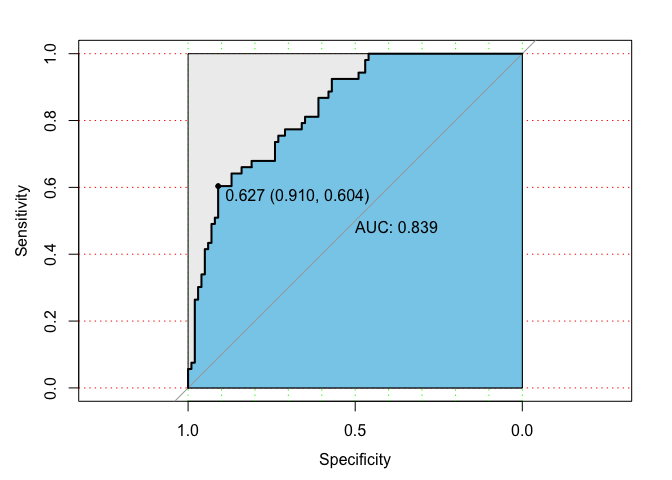

Naive Bayes Analysis
================

#### Load packages

``` r
library(tidyverse)    # data manipulation
library(rpart)        # decision tree
library(randomForest)
library(e1071)        # Naive Bayes algorithms
library(mlbench)      # PimaIndiansDiabetes2 dataset
library(caret)        # Impute missing values
```

#### Load `PimaIndiansDiabetes2`

``` r
data(PimaIndiansDiabetes2)
PimaIndiansDiabetes2 <- as_tibble(PimaIndiansDiabetes2)
str(PimaIndiansDiabetes2)
```

    ## Classes 'tbl_df', 'tbl' and 'data.frame':    768 obs. of  9 variables:
    ##  $ pregnant: num  6 1 8 1 0 5 3 10 2 8 ...
    ##  $ glucose : num  148 85 183 89 137 116 78 115 197 125 ...
    ##  $ pressure: num  72 66 64 66 40 74 50 NA 70 96 ...
    ##  $ triceps : num  35 29 NA 23 35 NA 32 NA 45 NA ...
    ##  $ insulin : num  NA NA NA 94 168 NA 88 NA 543 NA ...
    ##  $ mass    : num  33.6 26.6 23.3 28.1 43.1 25.6 31 35.3 30.5 NA ...
    ##  $ pedigree: num  0.627 0.351 0.672 0.167 2.288 ...
    ##  $ age     : num  50 31 32 21 33 30 26 29 53 54 ...
    ##  $ diabetes: Factor w/ 2 levels "neg","pos": 2 1 2 1 2 1 2 1 2 2 ...

``` r
summary(PimaIndiansDiabetes2)
```

    ##     pregnant         glucose         pressure         triceps     
    ##  Min.   : 0.000   Min.   : 44.0   Min.   : 24.00   Min.   : 7.00  
    ##  1st Qu.: 1.000   1st Qu.: 99.0   1st Qu.: 64.00   1st Qu.:22.00  
    ##  Median : 3.000   Median :117.0   Median : 72.00   Median :29.00  
    ##  Mean   : 3.845   Mean   :121.7   Mean   : 72.41   Mean   :29.15  
    ##  3rd Qu.: 6.000   3rd Qu.:141.0   3rd Qu.: 80.00   3rd Qu.:36.00  
    ##  Max.   :17.000   Max.   :199.0   Max.   :122.00   Max.   :99.00  
    ##                   NA's   :5       NA's   :35       NA's   :227    
    ##     insulin            mass          pedigree           age       
    ##  Min.   : 14.00   Min.   :18.20   Min.   :0.0780   Min.   :21.00  
    ##  1st Qu.: 76.25   1st Qu.:27.50   1st Qu.:0.2437   1st Qu.:24.00  
    ##  Median :125.00   Median :32.30   Median :0.3725   Median :29.00  
    ##  Mean   :155.55   Mean   :32.46   Mean   :0.4719   Mean   :33.24  
    ##  3rd Qu.:190.00   3rd Qu.:36.60   3rd Qu.:0.6262   3rd Qu.:41.00  
    ##  Max.   :846.00   Max.   :67.10   Max.   :2.4200   Max.   :81.00  
    ##  NA's   :374      NA's   :11                                      
    ##  diabetes 
    ##  neg:500  
    ##  pos:268  
    ##           
    ##           
    ##           
    ##           
    ## 

#### Impute missing values with `caret`

``` r
preProc <- PimaIndiansDiabetes2 %>% 
  select(-diabetes) %>% 
  preProcess(method = "bagImpute")
#col_diabetes <- PimaIndiansDiabetes2$diabetes
PID2    <- predict(preProc, PimaIndiansDiabetes2[, -9]) %>% 
  bind_cols(select(PimaIndiansDiabetes2, diabetes))

#summary(PID2) # no missing value
```

#### Split PID2 into trani and test portions

``` r
set.seed(54321)
index     <- createDataPartition(PID2$diabetes, p = 0.8, list = F)
train_df  <- PID2[ index, ]
test_df   <- PID2[-index, ]

# Examine the proportions of the Survived class lable across
# the datasets.
table(PID2$diabetes) %>% prop.table()
```

    ## 
    ##       neg       pos 
    ## 0.6510417 0.3489583

``` r
table(train_df$diabetes) %>% prop.table()
```

    ## 
    ##       neg       pos 
    ## 0.6504065 0.3495935

``` r
table(test_df$diabetes) %>% prop.table()
```

    ## 
    ##       neg       pos 
    ## 0.6535948 0.3464052

#### Naive Bayes model

``` r
mod1  <- naiveBayes(diabetes ~ ., data = train_df)
pred1 <- predict(mod1, test_df)
table(pred1, test_df$diabetes)
```

    ##      
    ## pred1 neg pos
    ##   neg  86  19
    ##   pos  14  34

#### Valide model

``` r
library(gmodels)
# NB
CrossTable(test_df$diabetes, pred1, prop.r = F, prop.c = F, prop.t = T, prop.chisq = F)
```

    ## 
    ##  
    ##    Cell Contents
    ## |-------------------------|
    ## |                       N |
    ## |         N / Table Total |
    ## |-------------------------|
    ## 
    ##  
    ## Total Observations in Table:  153 
    ## 
    ##  
    ##                  | pred1 
    ## test_df$diabetes |       neg |       pos | Row Total | 
    ## -----------------|-----------|-----------|-----------|
    ##              neg |        86 |        14 |       100 | 
    ##                  |     0.562 |     0.092 |           | 
    ## -----------------|-----------|-----------|-----------|
    ##              pos |        19 |        34 |        53 | 
    ##                  |     0.124 |     0.222 |           | 
    ## -----------------|-----------|-----------|-----------|
    ##     Column Total |       105 |        48 |       153 | 
    ## -----------------|-----------|-----------|-----------|
    ## 
    ## 

``` r
# DT
#CrossTable(test_df$diabetes, pred2, prop.r = F, prop.c = F, prop.t = T, prop.chisq = F)
# RF
#CrossTable(test_df$diabetes, pred3, prop.r = F, prop.c = F, prop.t = T, prop.chisq = F)
```

#### Display and Analyze ROC Curves `pROC`

``` r
library(pROC)
pre <- predict(mod1, test_df, type = "raw")
modROC <- roc(test_df$diabetes, pre[, 2])
plot(modROC, print.auc = T, print.thres = T,
     auc.polygon = T, max.auc.polygon = T, auc.polygon.col = "skyblue",
     grid = c(0.1, 0.2), grid.col = c("green", "red"))
```

<!-- -->

#### Comparison with other models

##### Decision Tree and Random Forrest

``` r
#NB
mod1  <- naiveBayes(diabetes ~ ., data = train_df)
pred1 <- predict(mod1, test_df)
table(pred1, test_df$diabetes)
```

    ##      
    ## pred1 neg pos
    ##   neg  86  19
    ##   pos  14  34

``` r
#DT
mod2  <- rpart(diabetes ~ ., data = train_df, method = "class")
pred2 <- predict(mod2, test_df, type = "class")
table(pred2, test_df$diabetes)
```

    ##      
    ## pred2 neg pos
    ##   neg  79  19
    ##   pos  21  34

``` r
#RF
mod3  <- randomForest(diabetes ~ ., data = train_df, ntree = 300)
pred3 <- predict(mod3, test_df)
table(pred3, test_df$diabetes)
```

    ##      
    ## pred3 neg pos
    ##   neg  84  20
    ##   pos  16  33

##### Use `caret` wrapper with NB packages

  - `e1071`, `klaR`, `naivebayes` and `bnclassify`

<!-- end list -->

``` r
Ctrl  <- trainControl(method = "cv", number = 10)
set.seed(3456)
mod4  <- train(diabetes ~ ., data = train_df, method = "nb", trControl = Ctrl)
pred4 <- predict(mod4, test_df)
table(pred4, test_df$diabetes)
```

    ##      
    ## pred4 neg pos
    ##   neg  81  20
    ##   pos  19  33

##### Extreme Gradient Boosting

``` r
train.control <- trainControl(method = "repeatedcv", number = 10, repeats = 3,
                              search = "grid")

# Leverage a grid search of hyperparameters for xgboost. See 
# the following presentation for more information:
# https://www.slideshare.net/odsc/owen-zhangopen-sourcetoolsanddscompetitions1
tune.grid <- expand.grid(eta              = c(0.05, 0.075, 0.1),
                         nrounds          = c(50, 75, 100),
                         max_depth        = 6:8,
                         min_child_weight = c(2.0, 2.25, 2.5),
                         colsample_bytree = c(0.3, 0.4, 0.5),
                         gamma            = 0,
                         subsample        = 1)
library(doParallel)
```

    ## Loading required package: foreach

    ## 
    ## Attaching package: 'foreach'

    ## The following objects are masked from 'package:purrr':
    ## 
    ##     accumulate, when

    ## Loading required package: iterators

    ## Loading required package: parallel

``` r
cl <- makeCluster(4)
registerDoParallel(cl)


mod5 <- train(diabetes ~ ., 
                   data      = train_df,
                   method    = "xgbTree",
                   tuneGrid  = tune.grid,
                   trControl = train.control)
stopCluster(cl)

pred5 <- predict(mod5, test_df)
table(pred5, test_df$diabetes)
```

    ##      
    ## pred5 neg pos
    ##   neg  81  25
    ##   pos  19  28

``` r
# Use caret's confusionMatrix() function to estimate the 
# effectiveness of this model on unseen, new data.
confusionMatrix(pred5, test_df$diabetes)
```

    ## Confusion Matrix and Statistics
    ## 
    ##           Reference
    ## Prediction neg pos
    ##        neg  81  25
    ##        pos  19  28
    ##                                           
    ##                Accuracy : 0.7124          
    ##                  95% CI : (0.6338, 0.7826)
    ##     No Information Rate : 0.6536          
    ##     P-Value [Acc > NIR] : 0.07283         
    ##                                           
    ##                   Kappa : 0.3475          
    ##  Mcnemar's Test P-Value : 0.45098         
    ##                                           
    ##             Sensitivity : 0.8100          
    ##             Specificity : 0.5283          
    ##          Pos Pred Value : 0.7642          
    ##          Neg Pred Value : 0.5957          
    ##              Prevalence : 0.6536          
    ##          Detection Rate : 0.5294          
    ##    Detection Prevalence : 0.6928          
    ##       Balanced Accuracy : 0.6692          
    ##                                           
    ##        'Positive' Class : neg             
    ##
