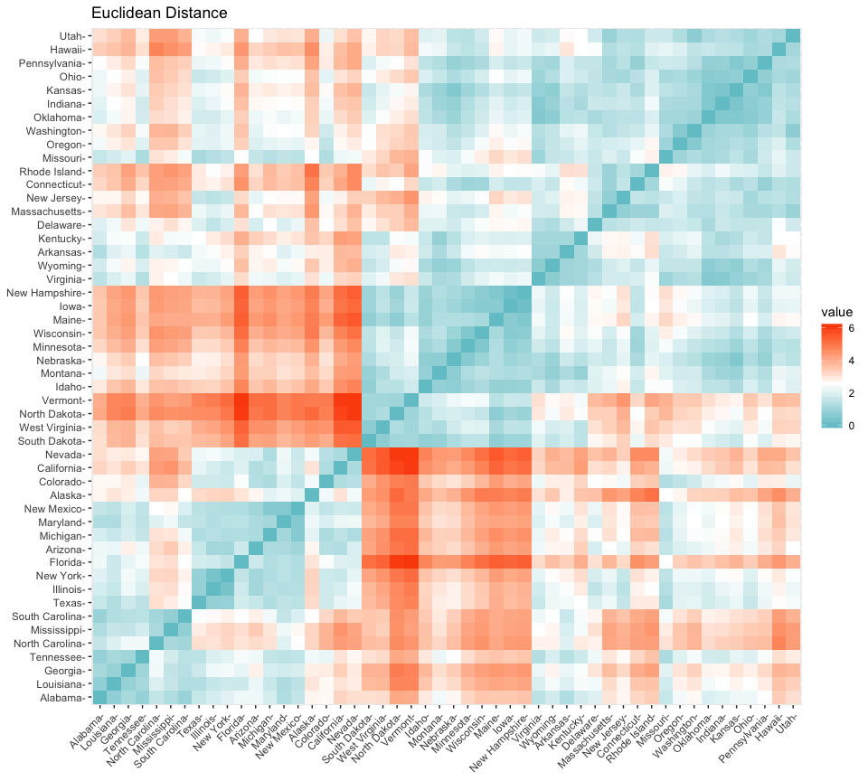
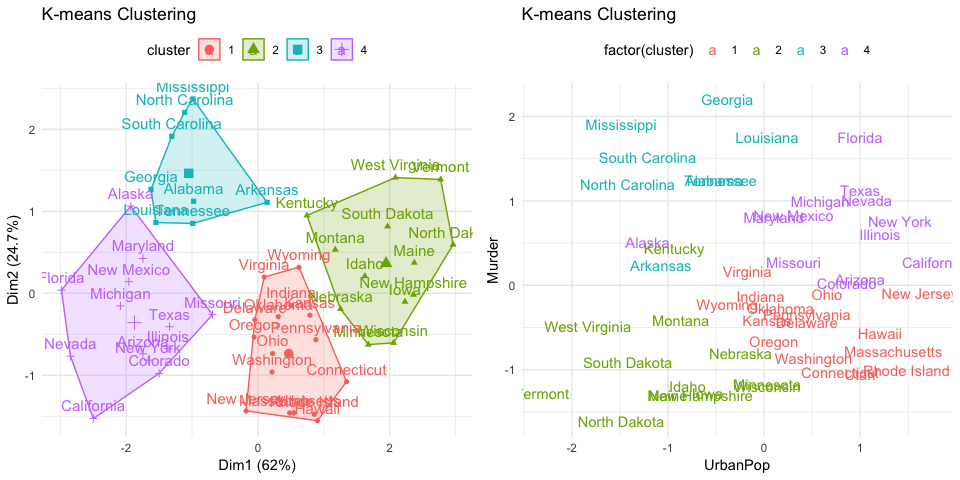
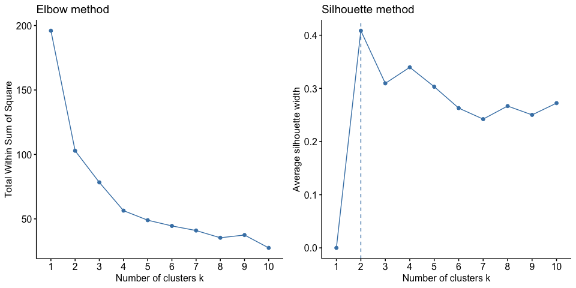

K-means Cluster Analysis
================

[UC Business Analytics R Programming
Guide](http://uc-r.github.io/kmeans_clustering)

#### Load packages

``` r
library(tidyverse)  # data manipulation
library(cluster)    # clustering algorithms
library(factoextra) # clustering algorithms & visualization

USA_df    <- scale(USArrests)
```

#### Clustering Distance

Euclidean distance  
\[d_{euc}(x, y) = \sqrt{\sum_{i=1}^{n} (x_{i}-y_{y})^2}\]

``` r
distance  <- get_dist(USA_df) # default Euclidean distance
fviz_dist(distance, 
          gradient = list(low = "#00AFBB", mid = "white", high = "#FC4E07")) +
  ggtitle("Euclidean Distance")
```

<!-- -->

#### k-means clustering

``` r
k4 <- kmeans(USA_df,      # numeric matrix
             centers = 4, # number of clusters
             nstart = 25  # Report the best one for random sets
             )
p1 <- fviz_cluster(k4, data = USA_df) +
  ggtitle("K-means Clustering") +
  theme_minimal() +
  theme(legend.position = "top")

p2 <- USA_df %>%
  as_tibble() %>%
  mutate(cluster = k4$cluster,
         state = row.names(USArrests)) %>%
  ggplot(aes(UrbanPop, Murder, color = factor(cluster), label = state)) +
  geom_text() +
  ggtitle("K-means Clustering") +
  theme_minimal() +
  theme(legend.position = "top")

gridExtra::grid.arrange(p1, p2, ncol = 2)
```

<!-- -->

#### How to determine the number of clusters

[An Introduction to Machine Learning with R by Laurent
Gatto](https://lgatto.github.io/IntroMachineLearningWithR/unsupervised-learning.html#how-to-determine-the-number-of-clusters)

  - Run k-means with k=1, k=2, …, k=n
  - Record total within SS for each value of k.
  - Choose k at the elbow position, as illustrated below.

<!-- end list -->

``` r
ks <- 1:10

tot_within_ss <- sapply(ks, function(k) {
    cl <- kmeans(USA_df, k, nstart = 10)
    cl$tot.withinss
})

plot(ks, tot_within_ss, type = "b",
     xlab = "Value of clusters k",
     ylab = "Total within squared distances")
```

<!-- -->

Or, use a wrapper `fviz_nbclust`

``` r
set.seed(123)
# Elbow method
g1 <- fviz_nbclust(USA_df, kmeans, method = "wss") +
  ggtitle("Elbow method")
# Silhouette method
g2 <- fviz_nbclust(USA_df, kmeans, method = "silhouette") +
  ggtitle("Silhouette method")
# Gap statistic
gridExtra::grid.arrange(g1, g2, ncol = 2) 
```

<!-- -->
