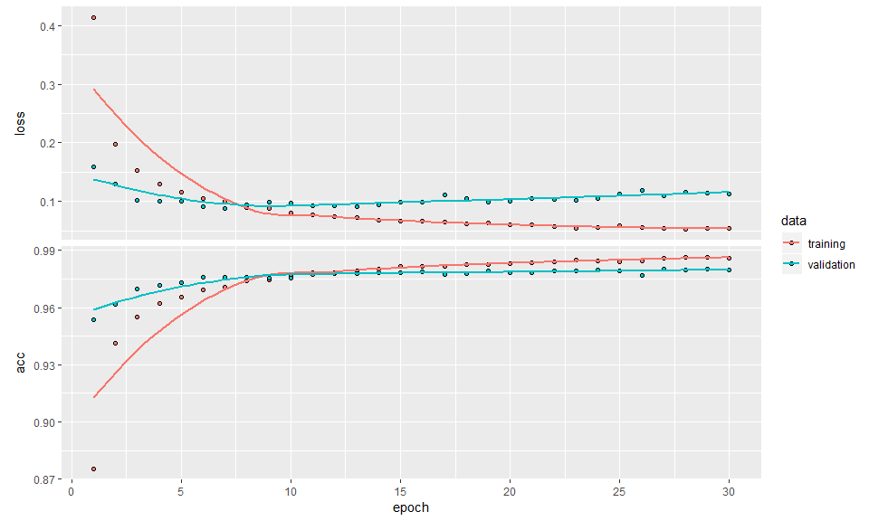

Replicate the example case on
[keras.rstudio.com](https://keras.rstudio.com/)

``` r
library(tidyverse)
library(keras)
```

### `keras` environment

``` r
# https://github.com/rstudio/keras/issues/256
#install_keras(conda = "C:/Users/xiao/AppData/Local/Continuum/anaconda3/Scripts/conda.exe")
#conda install -c hesi_m keras
use_python("C:/Users/xiao/AppData/Local/Continuum/anaconda3/python.exe")
```

### Preparing the Data

``` r
mnist   <- dataset_mnist()
x_train <- mnist$train$x
y_train <- mnist$train$y
x_test  <- mnist$test$x
y_test  <- mnist$test$y
```

### Convert 3-D array to 2-D matrix

``` r
# reshape
x_train <- array_reshape(x_train, c(nrow(x_train), 784))
x_test  <- array_reshape(x_test, c(nrow(x_test), 784))
# rescale
x_train <- x_train / 255
x_test  <- x_test / 255
```

### Convert the outcome y to dummy columns

``` r
y_train <- to_categorical(y_train, 10)
y_test  <- to_categorical(y_test, 10)
```

### Define the `model`, a new data structure

``` r
model <- keras_model_sequential() 
```

### Add layers to the `model`

``` r
model %>% 
  layer_dense(units = 256, activation = 'relu', input_shape = c(784)) %>% 
  layer_dropout(rate = 0.4) %>% 
  layer_dense(units = 128, activation = 'relu') %>%
  layer_dropout(rate = 0.3) %>%
  layer_dense(units = 10, activation = 'softmax')

summary(model)
```

    ## ___________________________________________________________________________
    ## Layer (type)                     Output Shape                  Param #     
    ## ===========================================================================
    ## dense_1 (Dense)                  (None, 256)                   200960      
    ## ___________________________________________________________________________
    ## dropout_1 (Dropout)              (None, 256)                   0           
    ## ___________________________________________________________________________
    ## dense_2 (Dense)                  (None, 128)                   32896       
    ## ___________________________________________________________________________
    ## dropout_2 (Dropout)              (None, 128)                   0           
    ## ___________________________________________________________________________
    ## dense_3 (Dense)                  (None, 10)                    1290        
    ## ===========================================================================
    ## Total params: 235,146
    ## Trainable params: 235,146
    ## Non-trainable params: 0
    ## ___________________________________________________________________________

### Compile the model

``` r
model %>% 
  compile(loss = 'categorical_crossentropy',
          optimizer = optimizer_rmsprop(),
          metrics = c('accuracy'))
```

### Training and Evaluation

``` r
history <- model %>% 
  fit(x_train, y_train,
      epochs = 30, batch_size = 128,
      validation_split = 0.2)
plot(history)
```

<!-- -->

``` r
model %>% evaluate(x_test, y_test)
```

    ## $loss
    ## [1] 0.1059997
    ## 
    ## $acc
    ## [1] 0.9811

``` r
model %>% predict_classes(x_test) %>% head()
```

    ## [1] 7 2 1 0 4 1
