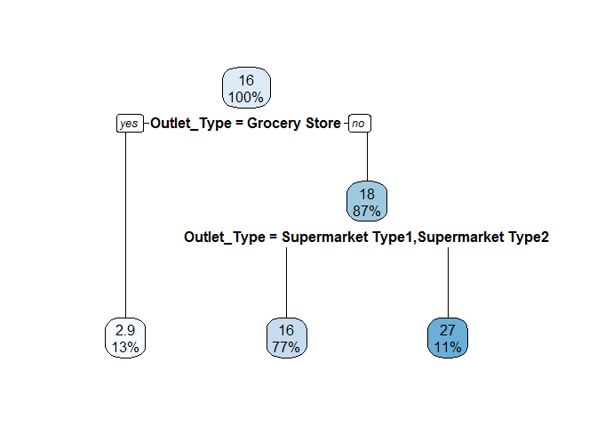

### Load library

``` r
xlib  <- c("tidyverse", "grid", "gridExtra", "caret", "randomForest", "xgboost", "Hmisc", "rpart", "rpart.plot")
lib   <- lapply(xlib, library, character.only = TRUE) # load the required packages
```

### Load Data

``` r
train.data  <- read_csv("data/Train_UWu5bXk.csv")
```

    ## Parsed with column specification:
    ## cols(
    ##   Item_Identifier = col_character(),
    ##   Item_Weight = col_double(),
    ##   Item_Fat_Content = col_character(),
    ##   Item_Visibility = col_double(),
    ##   Item_Type = col_character(),
    ##   Item_MRP = col_double(),
    ##   Outlet_Identifier = col_character(),
    ##   Outlet_Establishment_Year = col_integer(),
    ##   Outlet_Size = col_character(),
    ##   Outlet_Location_Type = col_character(),
    ##   Outlet_Type = col_character(),
    ##   Item_Outlet_Sales = col_double()
    ## )

``` r
test.data   <- read_csv("data/Test_u94Q5KV.csv")
```

    ## Parsed with column specification:
    ## cols(
    ##   Item_Identifier = col_character(),
    ##   Item_Weight = col_double(),
    ##   Item_Fat_Content = col_character(),
    ##   Item_Visibility = col_double(),
    ##   Item_Type = col_character(),
    ##   Item_MRP = col_double(),
    ##   Outlet_Identifier = col_character(),
    ##   Outlet_Establishment_Year = col_integer(),
    ##   Outlet_Size = col_character(),
    ##   Outlet_Location_Type = col_character(),
    ##   Outlet_Type = col_character()
    ## )

``` r
test.data$Item_Outlet_Sales <- NA

all_bms <- bind_rows(train.data, test.data)
```

### Data Cleaning

#### Missing Values: Item\_Weight

Basic R

``` r
tmp <- aggregate(Item_Weight ~ Item_Identifier, data = all_bms, FUN = mean)
for (i in which(is.na(all_bms$Item_Weight))) {
  all_bms$Item_Weight[i] <- tmp$Item_Weight[tmp$Item_Identifier == all_bms$Item_Identifier[i]]
}
```

`tidyverse`

``` r
# Missing value of Item_Weight is filled by its average
tmp <- all_bms %>% 
  group_by(Item_Identifier) %>%
  summarise(Mean_Item_Weight = mean(Item_Weight, na.rm = T))
all_bms1 <- all_bms %>% 
  left_join(tmp) %>% 
  mutate(Item_Weight = if_else(is.na(Item_Weight), Mean_Item_Weight, Item_Weight)) %>% 
  select(-Mean_Item_Weight)
```

    ## Joining, by = "Item_Identifier"

``` r
sum(is.na(all_bms1$Item_Weight))
```

    ## [1] 0

#### Missing Values: Outlet\_Size

##### Summary of Outlet\_Size

``` r
table(all_bms1$Outlet_Size, all_bms1$Outlet_Identifier)
```

    ##         
    ##          OUT010 OUT013 OUT017 OUT018 OUT019 OUT027 OUT035 OUT045 OUT046
    ##   High        0   1553      0      0      0      0      0      0      0
    ##   Medium      0      0      0   1546      0   1559      0      0      0
    ##   Small       0      0      0      0    880      0   1550      0   1550
    ##         
    ##          OUT049
    ##   High        0
    ##   Medium   1550
    ##   Small       0

``` r
all_bms1 %>%
  group_by(Outlet_Identifier, Outlet_Size) %>%
  summarise(count = n())
```

    ## # A tibble: 10 x 3
    ## # Groups:   Outlet_Identifier [?]
    ##    Outlet_Identifier Outlet_Size count
    ##    <chr>             <chr>       <int>
    ##  1 OUT010            <NA>          925
    ##  2 OUT013            High         1553
    ##  3 OUT017            <NA>         1543
    ##  4 OUT018            Medium       1546
    ##  5 OUT019            Small         880
    ##  6 OUT027            Medium       1559
    ##  7 OUT035            Small        1550
    ##  8 OUT045            <NA>         1548
    ##  9 OUT046            Small        1550
    ## 10 OUT049            Medium       1550

##### Fill the missing value with `tree`

``` r
fit <- rpart(factor(Outlet_Size) ~ Outlet_Type, 
             data = filter(all_bms, !is.na(Outlet_Size)),
             method = "class")
pred <- predict(fit, 
                data = filter(all_bms, is.na(Outlet_Size)), 
                type = "class")
all_bms2 <- all_bms1
all_bms2$Outlet_Size[is.na(all_bms2$Outlet_Size)] <- as.vector(pred)
```

    ## Warning in all_bms2$Outlet_Size[is.na(all_bms2$Outlet_Size)] <-
    ## as.vector(pred): number of items to replace is not a multiple of
    ## replacement length

``` r
table(all_bms2$Outlet_Size, all_bms2$Outlet_Identifier)
```

    ##         
    ##          OUT010 OUT013 OUT017 OUT018 OUT019 OUT027 OUT035 OUT045 OUT046
    ##   High        0   1553      0      0      0      0      0      0      0
    ##   Medium    279      0    468   1546      0   1559      0    473      0
    ##   Small     646      0   1075      0    880      0   1550   1075   1550
    ##         
    ##          OUT049
    ##   High        0
    ##   Medium   1550
    ##   Small       0

#### Classification: Unify

``` r
#all_bms2$Item_Fat_Content[all_bms2$Item_Fat_Content %in% 
#                           c("LF","low fat")] <- "Low Fat"
#all_bms2$Item_Fat_Content[all_bms2$Item_Fat_Content %in% 
#                           c("reg")] <- "Regular"
all_bms3 <- all_bms2 %>% 
  mutate(Item_Fat_Content = str_replace(Item_Fat_Content, "LF", "Low Fat"),
         Item_Fat_Content = str_replace(Item_Fat_Content, "low fat", "Low Fat"),
         Item_Fat_Content = str_replace(Item_Fat_Content, "reg", "Regular"))
table(all_bms3$Item_Fat_Content)
```

    ## 
    ## Low Fat Regular 
    ##    9185    5019

#### Classification: Additional

##### Information from Item\_Identifier

``` r
tmp3 <- all_bms3 %>% 
  mutate(Item_Attribute = substr(all_bms$Item_Identifier, 1, 2)) %>% 
  group_by(Item_Attribute) %>% 
  summarise(count = n())
tmp3
```

    ## # A tibble: 3 x 2
    ##   Item_Attribute count
    ##   <chr>          <int>
    ## 1 DR              1317
    ## 2 FD             10201
    ## 3 NC              2686

##### Food vs Non-Food

Basic R

``` r
all_bms$Item_Attribute <-  factor(substr(all_bms$Item_Identifier, 1, 2))
table(all_bms$Item_Attribute)

all_bms$Item_Fat_Content[all_bms$Item_Attribute == "NC"] <- "Non-Food"
table(all_bms$Item_Fat_Content)
```

`tidyverse`

``` r
all_bms4 <- all_bms3 %>% 
  mutate(Item_Attribute = substr(all_bms$Item_Identifier, 1, 2)) %>% 
  mutate(Item_Fat_Content = if_else(Item_Attribute == "NC", "Non-Food", Item_Fat_Content))
```

#### Fix Visibility == 0

There are 879 itmes with `Visibility == 0`

``` r
tmp4 <- all_bms4 %>% 
  group_by(Outlet_Identifier) %>% 
  summarise(Item_Visibility_mean = mean(Item_Visibility))

all_bms5 <- all_bms4 %>%
  left_join(tmp4) %>% 
  mutate(Item_Visibility = if_else(Item_Visibility == 0, Item_Visibility_mean, Item_Visibility)) %>% 
  select(-Item_Visibility_mean)
```

    ## Joining, by = "Outlet_Identifier"

``` r
sum(all_bms5$Item_Visibility==0)
```

    ## [1] 0

#### New Year Column

``` r
all_bms6 <- all_bms5 %>%
  mutate(Outlet_Years = 2013 - Outlet_Establishment_Year)
```

### Predictor: Item\_Sale\_Volumn

``` r
all_bms7 <- all_bms6 %>%
  mutate(Item_Sales_Vol = round(Item_Outlet_Sales / Item_MRP + 0.5, 0))
```

### Factorize

``` r
cols <- c("Item_Fat_Content", "Item_Type", "Outlet_Location_Type", "Outlet_Size",
          "Outlet_Type", "Outlet_Years", "Item_Attribute", "Outlet_Identifier")

all_bms8 <- all_bms7 %>% 
  mutate_at(cols, factor)
```

### Split

``` r
all_bms <- all_bms8
train <- all_bms[!is.na(all_bms$Item_Outlet_Sales), ]
test  <- all_bms[is.na(all_bms$Item_Outlet_Sales), ]

save(train, file = "output/train_clean.RData")
save(test,  file = "output/test_clean.RData")

set.seed(1234)
ind       <- createDataPartition(train$Item_Sales_Vol, p = .7, list = FALSE)
train_val <- train[ind, ]
test_val  <- train[-ind, ]
```

### Build Model

``` r
myformula <- Item_Sales_Vol ~ Outlet_Type + Item_Visibility + 
  Outlet_Location_Type + Item_MRP + Item_Type + Outlet_Years + Outlet_Size

model.rmse <- function(pred, act){
  sqrt(sum((act - pred)^2)/length(act))
}
```

#### Model 1: Decision Tree

``` r
fit.tr <- rpart(myformula, 
                data = train_val, 
                method = "anova")
summary(fit.tr)
```

    ## Call:
    ## rpart(formula = myformula, data = train_val, method = "anova")
    ##   n= 5967 
    ## 
    ##          CP nsplit rel error    xerror       xstd
    ## 1 0.2878296      0 1.0000000 1.0004979 0.01914448
    ## 2 0.1305417      1 0.7121704 0.7126310 0.01631714
    ## 3 0.0100000      2 0.5816286 0.5821792 0.01210822
    ## 
    ## Variable importance
    ##     Outlet_Type    Outlet_Years Item_Visibility 
    ##              70              24               7 
    ## 
    ## Node number 1: 5967 observations,    complexity param=0.2878296
    ##   mean=15.91336, MSE=84.54939 
    ##   left son=2 (753 obs) right son=3 (5214 obs)
    ##   Primary splits:
    ##       Outlet_Type          splits as  LRRR, improve=0.28782960, (0 missing)
    ##       Outlet_Years         splits as  RRRRRLRRR, improve=0.13369320, (0 missing)
    ##       Outlet_Size          splits as  RRL, improve=0.05115327, (0 missing)
    ##       Item_Visibility      < 0.1894785 to the right, improve=0.03548387, (0 missing)
    ##       Outlet_Location_Type splits as  LRR, improve=0.02241791, (0 missing)
    ##   Surrogate splits:
    ##       Outlet_Years    splits as  RRRRRLRRR, agree=0.936, adj=0.497, (0 split)
    ##       Item_Visibility < 0.1894785 to the right, agree=0.891, adj=0.139, (0 split)
    ## 
    ## Node number 2: 753 observations
    ##   mean=2.932271, MSE=2.29953 
    ## 
    ## Node number 3: 5214 observations,    complexity param=0.1305417
    ##   mean=17.78807, MSE=68.57745 
    ##   left son=6 (4566 obs) right son=7 (648 obs)
    ##   Primary splits:
    ##       Outlet_Type          splits as  -LLR, improve=0.184188900, (0 missing)
    ##       Outlet_Years         splits as  LLLLL-LLR, improve=0.184188900, (0 missing)
    ##       Outlet_Size          splits as  LRL, improve=0.020820550, (0 missing)
    ##       Outlet_Location_Type splits as  LLR, improve=0.020754010, (0 missing)
    ##       Item_MRP             < 143.497   to the left,  improve=0.001967564, (0 missing)
    ## 
    ## Node number 6: 4566 observations
    ##   mean=16.44919, MSE=51.43708 
    ## 
    ## Node number 7: 648 observations
    ##   mean=27.22222, MSE=87.71914

``` r
rpart.plot(fit.tr)
```



``` r
pred  <- predict(fit.tr, test_val)
model.rmse(pred * test_val$Item_MRP, test_val$Item_Outlet_Sales)
```

    ## [1] 1058.521

``` r
pred.test <- predict(fit.tr, test)
submit    <- data.frame(Item_Identifier = test.data$Item_Identifier, 
                        Outlet_Identifier = test.data$Outlet_Identifier, 
                        Item_Outlet_Sales = pred.test * test$Item_MRP)
write.csv(submit, file = "output/dtree.csv", row.names = FALSE)
```

#### Model 2: Random Forest

``` r
set.seed(2345)
fit.rf  <- randomForest(myformula, 
                       data = train_val,
                       ntree = 500)
summary(fit.rf)
```

    ##                 Length Class  Mode     
    ## call               4   -none- call     
    ## type               1   -none- character
    ## predicted       5967   -none- numeric  
    ## mse              500   -none- numeric  
    ## rsq              500   -none- numeric  
    ## oob.times       5967   -none- numeric  
    ## importance         7   -none- numeric  
    ## importanceSD       0   -none- NULL     
    ## localImportance    0   -none- NULL     
    ## proximity          0   -none- NULL     
    ## ntree              1   -none- numeric  
    ## mtry               1   -none- numeric  
    ## forest            11   -none- list     
    ## coefs              0   -none- NULL     
    ## y               5967   -none- numeric  
    ## test               0   -none- NULL     
    ## inbag              0   -none- NULL     
    ## terms              3   terms  call

``` r
pred    <- predict(fit.rf, test_val)
model.rmse(pred*test_val$Item_MRP, test_val$Item_Outlet_Sales)
```

    ## [1] 1063.282

``` r
pred.test <- predict(fit.rf, test)
submit    <- data.frame(Item_Identifier = test.data$Item_Identifier, 
                        Outlet_Identifier = test.data$Outlet_Identifier, 
                        Item_Outlet_Sales = pred.test * test$Item_MRP)
write.csv(submit, file = "output/rf.csv", row.names = FALSE)
```

#### Model 3: GBM

``` r
Ctrl    <- trainControl(method = "repeatedcv", number = 5, repeats = 5)
set.seed(3456)
fit.gbm <- train(myformula, 
                 data = train_val, 
                 trControl = Ctrl, 
                 method = "gbm", 
                 verbose = FALSE)
summary(fit.gbm)
```


    ##                                                           var     rel.inf
    ## Outlet_TypeSupermarket Type3     Outlet_TypeSupermarket Type3 42.01964457
    ## Outlet_TypeSupermarket Type1     Outlet_TypeSupermarket Type1 31.44793525
    ## Outlet_TypeSupermarket Type2     Outlet_TypeSupermarket Type2 20.40042914
    ## Item_MRP                                             Item_MRP  2.09066226
    ## Outlet_Years15                                 Outlet_Years15  0.73193088
    ## Item_Visibility                               Item_Visibility  0.55227273
    ## Outlet_Years28                                 Outlet_Years28  0.53995182
    ## Outlet_Years11                                 Outlet_Years11  0.33319222
    ## Item_TypeSoft Drinks                     Item_TypeSoft Drinks  0.32534169
    ## Outlet_Location_TypeTier 2         Outlet_Location_TypeTier 2  0.29200496
    ## Item_TypeFruits and Vegetables Item_TypeFruits and Vegetables  0.21772237
    ## Item_TypeSeafood                             Item_TypeSeafood  0.20082577
    ## Item_TypeHard Drinks                     Item_TypeHard Drinks  0.18807599
    ## Outlet_Years6                                   Outlet_Years6  0.14583341
    ## Outlet_Years14                                 Outlet_Years14  0.13483558
    ## Item_TypeCanned                               Item_TypeCanned  0.07352175
    ## Item_TypeHealth and Hygiene       Item_TypeHealth and Hygiene  0.06264441
    ## Outlet_Years9                                   Outlet_Years9  0.05908614
    ## Outlet_SizeSmall                             Outlet_SizeSmall  0.05297019
    ## Item_TypeBreakfast                         Item_TypeBreakfast  0.04523752
    ## Item_TypeStarchy Foods                 Item_TypeStarchy Foods  0.04465430
    ## Outlet_SizeMedium                           Outlet_SizeMedium  0.04122706
    ## Outlet_Location_TypeTier 3         Outlet_Location_TypeTier 3  0.00000000
    ## Item_TypeBreads                               Item_TypeBreads  0.00000000
    ## Item_TypeDairy                                 Item_TypeDairy  0.00000000
    ## Item_TypeFrozen Foods                   Item_TypeFrozen Foods  0.00000000
    ## Item_TypeHousehold                         Item_TypeHousehold  0.00000000
    ## Item_TypeMeat                                   Item_TypeMeat  0.00000000
    ## Item_TypeOthers                               Item_TypeOthers  0.00000000
    ## Item_TypeSnack Foods                     Item_TypeSnack Foods  0.00000000
    ## Outlet_Years16                                 Outlet_Years16  0.00000000
    ## Outlet_Years26                                 Outlet_Years26  0.00000000

``` r
pred    <- predict(fit.gbm, test_val)
model.rmse(pred*test_val$Item_MRP, test_val$Item_Outlet_Sales)
```

    ## [1] 1054.335

``` r
pred.test <- predict(fit.gbm, test)
submit    <- data.frame(Item_Identifier = test$Item_Identifier, 
                        Outlet_Identifier = test$Outlet_Identifier, 
                        Item_Outlet_Sales = pred.test*test$Item_MRP)
write.csv(submit, file = "output/gbm5cv.csv", row.names = FALSE)
```

#### Model 4: xgboost

##### Step 1: Sparse Matrix

``` r
mymatrix    <- function(train){
matrix_num  <- train[ , c("Item_Visibility", "Item_MRP")]
matrix_num  <- cbind(matrix_num,
                      model.matrix(~ Outlet_Type - 1, train),
                      model.matrix(~ Outlet_Location_Type - 1, train),
                      model.matrix(~ Outlet_Size - 1, train),
                      model.matrix(~ Item_Type - 1, train),
                      model.matrix(~ Outlet_Years - 1, train)
                      )
  return(data.matrix(matrix_num))
}


xgb.train_val <- mymatrix(train_val)
xgb.test_val  <- mymatrix(test_val)
xgb.test      <- mymatrix(test)

dtrain_val  <- xgb.DMatrix(data = xgb.train_val, label=train_val$Item_Sales_Vol)
dtest_val   <- xgb.DMatrix(data = xgb.test_val, label=test_val$Item_Sales_Vol)
dtest_sub   <- xgb.DMatrix(data = xgb.test)
```

##### Prelimilary

``` r
model     <- xgboost(data = dtrain_val, nround = 5)
```

    ## [1]  train-rmse:13.508470 
    ## [2]  train-rmse:10.661963 
    ## [3]  train-rmse:8.926338 
    ## [4]  train-rmse:7.913792 
    ## [5]  train-rmse:7.354428

``` r
summary(model)
```

    ##                Length Class              Mode       
    ## handle             1  xgb.Booster.handle externalptr
    ## raw            17930  -none-             raw        
    ## niter              1  -none-             numeric    
    ## evaluation_log     2  data.table         list       
    ## call              13  -none-             call       
    ## params             1  -none-             list       
    ## callbacks          2  -none-             list       
    ## feature_names     37  -none-             character  
    ## nfeatures          1  -none-             numeric

``` r
pred      <- predict(model,dtest_val)
model.rmse(pred*test_val$Item_MRP, test_val$Item_Outlet_Sales)
```

    ## [1] 1101.603

``` r
xgb.importance(colnames(xgb.train_val), model)
```

    ##                            Feature         Gain        Cover   Frequency
    ##  1:       Outlet_TypeGrocery Store 6.478786e-01 1.714300e-01 0.021645022
    ##  2:   Outlet_TypeSupermarket Type3 2.940067e-01 1.497966e-01 0.021645022
    ##  3:                       Item_MRP 1.728380e-02 1.845021e-01 0.303030303
    ##  4:                Item_Visibility 1.638001e-02 1.348054e-01 0.372294372
    ##  5:   Outlet_TypeSupermarket Type1 9.859069e-03 7.870785e-02 0.012987013
    ##  6:     Outlet_Location_TypeTier 3 1.725784e-03 7.120366e-02 0.012987013
    ##  7:                 Outlet_Years11 1.648405e-03 7.467995e-02 0.017316017
    ##  8: Item_TypeFruits and Vegetables 1.583171e-03 1.252614e-02 0.025974026
    ##  9:               Item_TypeSeafood 1.210876e-03 1.654255e-02 0.021645022
    ## 10:          Item_TypeBaking Goods 1.075105e-03 4.102599e-03 0.012987013
    ## 11:         Item_TypeStarchy Foods 1.060575e-03 3.775656e-02 0.017316017
    ## 12:             Item_TypeHousehold 9.077223e-04 4.516307e-03 0.021645022
    ## 13:             Item_TypeBreakfast 8.634009e-04 7.337562e-03 0.012987013
    ## 14:              Outlet_SizeMedium 7.969804e-04 8.044313e-05 0.004329004
    ## 15:           Item_TypeSoft Drinks 7.527908e-04 4.027902e-03 0.021645022
    ## 16:           Item_TypeSnack Foods 7.037444e-04 3.763589e-03 0.017316017
    ## 17:                Item_TypeBreads 6.429057e-04 2.913190e-03 0.008658009
    ## 18:                 Outlet_Years16 5.800428e-04 1.085982e-02 0.004329004
    ## 19:                Item_TypeOthers 3.853536e-04 3.717622e-03 0.008658009
    ## 20:                  Outlet_Years9 2.920216e-04 3.677400e-04 0.004329004
    ## 21:                 Outlet_Years14 1.777703e-04 1.666322e-04 0.004329004
    ## 22:          Item_TypeFrozen Foods 5.562413e-05 3.964697e-04 0.004329004
    ## 23:    Item_TypeHealth and Hygiene 4.628122e-05 1.298007e-02 0.012987013
    ## 24:                  Item_TypeMeat 3.334062e-05 7.768508e-03 0.012987013
    ## 25:           Item_TypeHard Drinks 3.083578e-05 4.861063e-03 0.008658009
    ## 26:                 Item_TypeDairy 1.375902e-05 1.034269e-04 0.008658009
    ## 27:     Outlet_Location_TypeTier 1 5.307846e-06 8.618906e-05 0.004329004
    ##                            Feature         Gain        Cover   Frequency

``` r
pred.test <- predict(model, dtest_sub)
submit    <- data.frame(Item_Identifier = test$Item_Identifier, 
                        Outlet_Identifier = test$Outlet_Identifier,
                        Item_Outlet_Sales = pred.test * test$Item_MRP)
write.csv(submit, file = "output/xgb.csv", row.names = FALSE)
```

##### Optimization

``` r
model_tuned <- xgboost(data = dtrain_val,
                       nround = 10,
                       max.depth = 5
                       )
```

    ## [1]  train-rmse:13.510375 
    ## [2]  train-rmse:10.671352 
    ## [3]  train-rmse:8.946833 
    ## [4]  train-rmse:7.955269 
    ## [5]  train-rmse:7.407856 
    ## [6]  train-rmse:7.117037 
    ## [7]  train-rmse:6.957079 
    ## [8]  train-rmse:6.871724 
    ## [9]  train-rmse:6.819139 
    ## [10] train-rmse:6.786467

``` r
summary(model_tuned)
```

    ##                Length Class              Mode       
    ## handle             1  xgb.Booster.handle externalptr
    ## raw            21678  -none-             raw        
    ## niter              1  -none-             numeric    
    ## evaluation_log     2  data.table         list       
    ## call              14  -none-             call       
    ## params             2  -none-             list       
    ## callbacks          2  -none-             list       
    ## feature_names     37  -none-             character  
    ## nfeatures          1  -none-             numeric

``` r
pred <- predict(model_tuned,dtest_val)
model.rmse(pred*test_val$Item_MRP, test_val$Item_Outlet_Sales)
```

    ## [1] 1057.67

``` r
xgb.importance(colnames(xgb.train_val), model_tuned)
```

    ##                            Feature         Gain        Cover   Frequency
    ##  1:       Outlet_TypeGrocery Store 6.387745e-01 0.2005127912 0.037037037
    ##  2:   Outlet_TypeSupermarket Type3 2.899420e-01 0.1752092665 0.037037037
    ##  3:                       Item_MRP 2.432679e-02 0.1558367805 0.274074074
    ##  4:                Item_Visibility 1.814757e-02 0.1436185048 0.351851852
    ##  5:   Outlet_TypeSupermarket Type1 9.936236e-03 0.0613736487 0.014814815
    ##  6:          Item_TypeBaking Goods 2.042103e-03 0.0134448077 0.018518519
    ##  7:                 Outlet_Years14 1.870906e-03 0.0002486668 0.007407407
    ##  8:                 Outlet_Years11 1.673651e-03 0.0523678790 0.014814815
    ##  9: Item_TypeFruits and Vegetables 1.639173e-03 0.0117511854 0.022222222
    ## 10:                  Outlet_Years6 1.431072e-03 0.0005578201 0.011111111
    ## 11:               Item_TypeSeafood 1.377938e-03 0.0372294489 0.022222222
    ## 12:     Outlet_Location_TypeTier 3 1.259853e-03 0.0416416040 0.011111111
    ## 13:         Item_TypeStarchy Foods 1.176253e-03 0.0239324971 0.011111111
    ## 14:           Item_TypeSnack Foods 9.972525e-04 0.0130146814 0.022222222
    ## 15:          Item_TypeFrozen Foods 8.226660e-04 0.0003091533 0.011111111
    ## 16:                 Outlet_Years16 7.051636e-04 0.0073793546 0.003703704
    ## 17:                Item_TypeBreads 6.576617e-04 0.0022615235 0.007407407
    ## 18:             Item_TypeHousehold 6.216114e-04 0.0026714877 0.014814815
    ## 19:             Item_TypeBreakfast 5.506406e-04 0.0195640267 0.007407407
    ## 20:     Outlet_Location_TypeTier 2 5.400344e-04 0.0109547796 0.003703704
    ## 21:           Item_TypeSoft Drinks 5.375628e-04 0.0023354515 0.018518519
    ## 22:                 Item_TypeDairy 3.015617e-04 0.0025202714 0.022222222
    ## 23:                  Outlet_Years9 2.819475e-04 0.0002150632 0.003703704
    ## 24:           Item_TypeHard Drinks 2.408336e-04 0.0043718308 0.007407407
    ## 25:    Item_TypeHealth and Hygiene 5.564842e-05 0.0080077423 0.014814815
    ## 26:                  Item_TypeMeat 4.359597e-05 0.0052858492 0.011111111
    ## 27:     Outlet_Location_TypeTier 1 2.205440e-05 0.0009039373 0.003703704
    ## 28:              Outlet_SizeMedium 1.586694e-05 0.0002856308 0.011111111
    ## 29:                Item_TypeOthers 7.785450e-06 0.0021943163 0.003703704
    ##                            Feature         Gain        Cover   Frequency

``` r
pred.test <- predict(model_tuned, dtest_sub)
submit <- data.frame(Item_Identifier = test$Item_Identifier, 
                     Outlet_Identifier = test$Outlet_Identifier, 
                     Item_Outlet_Sales = pred.test * test$Item_MRP)
write.csv(submit, file = "output/xgbn10d5.csv", row.names = FALSE)
```
