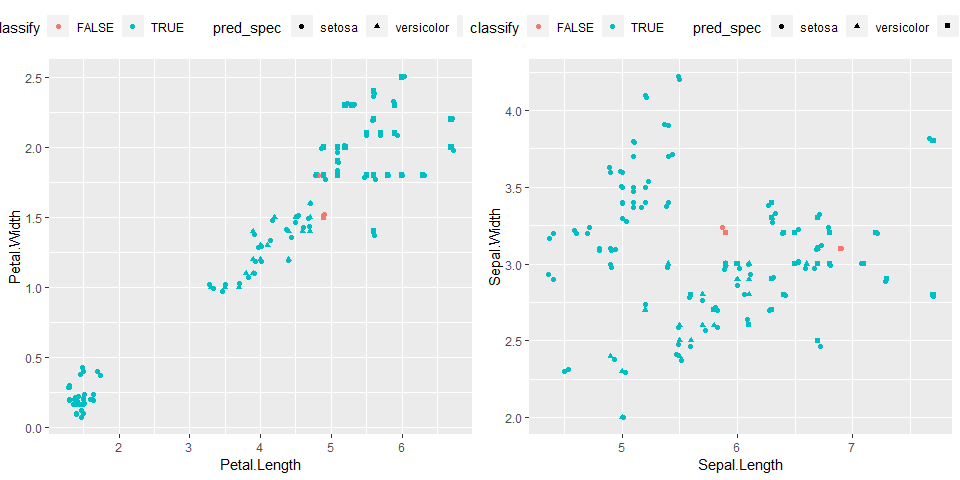

Decision Tree and Random Forest
================

A test case with the `iris` data
================================

The `datasets::iris` is a basic data set in R provided by [UCI's R.A. Fisher](https://archive.ics.uci.edu/ml/datasets/iris)

Load libraries
--------------

``` r
library(tidyverse)
library(rpart)
library(randomForest)
library(caret)       # used to split the data
```

Iris data description
---------------------

``` r
str(iris)
```

    ## 'data.frame':    150 obs. of  5 variables:
    ##  $ Sepal.Length: num  5.1 4.9 4.7 4.6 5 5.4 4.6 5 4.4 4.9 ...
    ##  $ Sepal.Width : num  3.5 3 3.2 3.1 3.6 3.9 3.4 3.4 2.9 3.1 ...
    ##  $ Petal.Length: num  1.4 1.4 1.3 1.5 1.4 1.7 1.4 1.5 1.4 1.5 ...
    ##  $ Petal.Width : num  0.2 0.2 0.2 0.2 0.2 0.4 0.3 0.2 0.2 0.1 ...
    ##  $ Species     : Factor w/ 3 levels "setosa","versicolor",..: 1 1 1 1 1 1 1 1 1 1 ...

``` r
summary(iris)
```

    ##   Sepal.Length    Sepal.Width     Petal.Length    Petal.Width   
    ##  Min.   :4.300   Min.   :2.000   Min.   :1.000   Min.   :0.100  
    ##  1st Qu.:5.100   1st Qu.:2.800   1st Qu.:1.600   1st Qu.:0.300  
    ##  Median :5.800   Median :3.000   Median :4.350   Median :1.300  
    ##  Mean   :5.843   Mean   :3.057   Mean   :3.758   Mean   :1.199  
    ##  3rd Qu.:6.400   3rd Qu.:3.300   3rd Qu.:5.100   3rd Qu.:1.800  
    ##  Max.   :7.900   Max.   :4.400   Max.   :6.900   Max.   :2.500  
    ##        Species  
    ##  setosa    :50  
    ##  versicolor:50  
    ##  virginica :50  
    ##                 
    ##                 
    ## 

``` r
#Hmisc::describe(iris)
```

A quick look at the data
------------------------

``` r
#qplot(Petal.Length, Petal.Width, colour = Species, data = iris)
#qplot(Sepal.Length, Sepal.Width, colour = Species, data = iris)
p1 <- ggplot(iris, aes(Petal.Length, Petal.Width)) + 
  geom_point(aes(color = Species)) +
  theme(legend.position = "top")
p2 <- ggplot(iris, aes(Sepal.Length, Sepal.Width)) + 
  geom_point(aes(color = Species)) +
  theme(legend.position = "top")
gridExtra::grid.arrange(p1, p2, ncol = 2)
```


Split the data into the *Train* part and the *Test* part
--------------------------------------------------------

``` r
set.seed(1234)
ind   <- createDataPartition(iris$Species, p = .5, list = FALSE)
Train <- iris[ind, ]
Test  <- iris[-ind, ]
```

Decision Tree model from `rpart`
--------------------------------

``` r
fitDT   <- train(Species ~ ., method = "rpart", data = Train)
```

### Validate and Test the DT model

``` r
#Validate againt the Train data part
predDT  <- predict(fitDT, Train)
table(predDT, Train$Species)
```

    ##             
    ## predDT       setosa versicolor virginica
    ##   setosa         25          0         0
    ##   versicolor      0         23         0
    ##   virginica       0          2        25

``` r
#Validate againt the Test data part
testDT  <- predict(fitDT, Test)
table(testDT, Test$Species)
```

    ##             
    ## testDT       setosa versicolor virginica
    ##   setosa         25          0         0
    ##   versicolor      0         21         1
    ##   virginica       0          4        24

### Look into the DT model

``` r
library(rpart.plot)
rpart.plot(fitDT$finalModel)
```


### Where are the misclassifications

``` r
pred_spec <- data.frame(pred_spec = predDT)
Train_c <- Train %>% 
  bind_cols(pred_spec) %>% 
  mutate(classify  = (pred_spec == Species))

g1 <- ggplot(Train_c, aes(Petal.Length, Petal.Width, color = classify)) + 
  geom_point(aes(shape = pred_spec)) +
  geom_jitter() +
  theme(legend.position = "top")

g2 <- ggplot(Train_c, aes(Sepal.Length, Sepal.Width, color = classify)) + 
  geom_point(aes(shape = pred_spec)) +
  geom_jitter() +
  theme(legend.position = "top")
gridExtra::grid.arrange(g1, g2, ncol = 2)
```

 The

Random Forest model from `randomForest`
---------------------------------------

``` r
set.seed(2345)
fitRF   <- train(Species ~ ., method = "rf", data = Train)
```

### Validate and Test the model

``` r
#Validate againt the Train data part
predRF  <- predict(fitRF, Train)
table(predRF, Train$Species)
```

    ##             
    ## predRF       setosa versicolor virginica
    ##   setosa         25          0         0
    ##   versicolor      0         25         0
    ##   virginica       0          0        25

``` r
#Validate againt the Test data part
testRF  <- predict(fitRF, Test)
table(testRF, Test$Species)
```

    ##             
    ## testRF       setosa versicolor virginica
    ##   setosa         25          0         0
    ##   versicolor      0         23         2
    ##   virginica       0          2        23

Uneven split
------------

``` r
set.seed(1000)
ind1   <- createDataPartition(iris$Species, p = .8, list = FALSE)
Train1 <- iris[ind1, ]
Test1  <- iris[-ind1, ]

fitDT1   <- train(Species ~ ., method = "rpart", data = Train1)

#Validate againt the Train data part
predDT1  <- predict(fitDT1, Train1)
table(predDT1, Train1$Species)
```

    ##             
    ## predDT1      setosa versicolor virginica
    ##   setosa         40          0         0
    ##   versicolor      0         37         2
    ##   virginica       0          3        38

``` r
#Validate againt the Test data part
testDT1  <- predict(fitDT1, Test1)
table(testDT1, Test1$Species)
```

    ##             
    ## testDT1      setosa versicolor virginica
    ##   setosa         10          0         0
    ##   versicolor      0          9         1
    ##   virginica       0          1         9

``` r
set.seed(1001)
fitRF1   <- train(Species ~ ., method = "rf", data = Train1)
#Validate againt the Train data part
predRF1  <- predict(fitRF1, Train1)
table(predRF1, Train1$Species)
```

    ##             
    ## predRF1      setosa versicolor virginica
    ##   setosa         40          0         0
    ##   versicolor      0         40         0
    ##   virginica       0          0        40

``` r
#Validate againt the Test data part
testRF1  <- predict(fitRF1, Test1)
table(testRF1, Test1$Species)
```

    ##             
    ## testRF1      setosa versicolor virginica
    ##   setosa         10          0         0
    ##   versicolor      0          9         0
    ##   virginica       0          1        10

Summary
-------

Misclassifications (Without any parameter tuning)

-   Even split (75/75)

| Model | Decision Tree | Random Forest |
|-------|---------------|---------------|
| Train | 2             | 0             |
| Test  | 5             | 4             |

-   0.8 split (120/30)

| Model | Decision Tree | Random Forest |
|-------|---------------|---------------|
| Train | 5             | 0             |
| Test  | 2             | 1             |
